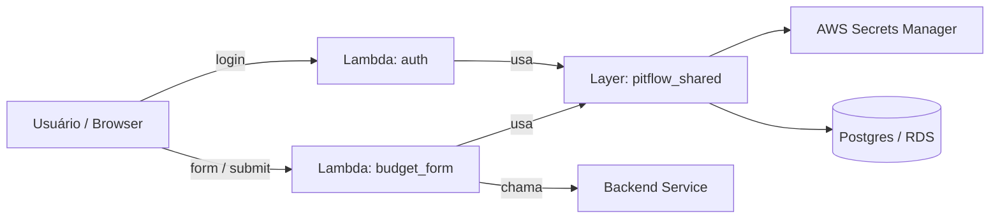

# pitflow-lambdas

## Descrição

O repositório contém duas funções AWS Lambda em Python que implementam parte do fluxo de negócio do Pitflow:

- `auth`: autenticação do cliente por CPF e emissão de token JWT.
- `budget_form`: disponibiliza um formulário HTML para inserir CPF e submeter decisão de aprovação/reprovação de orçamento, este formulário chama um serviço backend externo (Spring Boot).

Ambas as funções reutilizam uma Lambda Layer compartilhada (`layers/shared`) chamada `pitflow_shared`, que centraliza validação de CPF, acesso a dados de cliente e geração de JWT/consulta a segredos.

## Tecnologias

- Linguagem: Python 3.12
- Infra: Terraform (provisionamento das Lambdas, Layer e recursos associados)
- AWS: Lambda, Secrets Manager, RDS/Postgres (acesso via `customer_service`), S3 para backend de state do Terraform
- Dependências Python: PyJWT, psycopg2-binary, boto3 (ver `requirements.txt` e `layers/shared/requirements.txt`)

## Arquivos-chave

- Código das Lambdas:
	- [lambdas/auth/src/handler.py](lambdas/auth/src/handler.py)
	- [lambdas/budget_form/src/handler.py](lambdas/budget_form/src/handler.py)
	- [lambdas/budget_form/src/services/decision_service.py](lambdas/budget_form/src/services/decision_service.py)
	- [lambdas/budget_form/src/templates/budget_page.py](lambdas/budget_form/src/templates/budget_page.py)
- Layer compartilhada:
	- [layers/shared/python/pitflow_shared/cpf_validator.py](layers/shared/python/pitflow_shared/cpf_validator.py)
	- [layers/shared/python/pitflow_shared/customer_service.py](layers/shared/python/pitflow_shared/customer_service.py)
	- [layers/shared/python/pitflow_shared/jwt_service.py](layers/shared/python/pitflow_shared/jwt_service.py)
	- [layers/shared/python/pitflow_shared/secret_manager_service.py](layers/shared/python/pitflow_shared/secret_manager_service.py)
- Infra / Deploy:
	- [infra/terraform/lambdas.tf](infra/terraform/lambdas.tf)
	- [infra/terraform/scripts/build_artifacts.py](infra/terraform/scripts/build_artifacts.py)

## Pré-requisitos

- Python 3.12
- AWS CLI configurado (credenciais e região)
- Terraform instalado (versão compatível com provider AWS utilizado)
- Este repositório publica somente as funções Lambda e a Layer compartilhada. O
  API Gateway é gerenciado pelo Terraform do `pitflow-cluster-kubernetes`, que
  deve ser executado depois deste deploy.

## Execução local (desenvolvimento)

* 1  Crie e ative um ambiente virtual com Python 3.12.

```bash
python -m venv .venv
source .venv/Scripts/activate    # Windows: .venv\\Scripts\\activate
pip install -r requirements.txt
```

* 2 Para testar handlers localmente configure `IS_LOCAL=true` nas variáveis de ambiente e inclua a layer no `PYTHONPATH` para que o pacote `pitflow_shared` seja importado.
    * 2.1 Como localmente não utilizo o sercret-manger pode criar um arquivo .env e configurar a IDE para definir as variáveis de ambiente.
    ```
    # Configurações do Banco
    DB_NAME=pitflow_os
    DB_USER=pitflow
    DB_PASSWORD=pitflow
    DB_HOST=localhost
    DB_PORT=5432

    # Segurança
    JWT_SECRET=123456

    # Obter variáveis de ambiente para desenvolvimento local
    IS_LOCAL=true
    ```

Exemplos:

Unix/macOS (bash):

```bash
PYTHONPATH="$PWD/layers/shared/python" IS_LOCAL=true python lambdas/auth/src/handler.py
```

Windows (PowerShell):

```powershell
$env:PYTHONPATH = "$PWD\\layers\\shared\\python"; $env:IS_LOCAL = "true"; python lambdas/auth/src/handler.py
```

Obs: os handlers esperam que segredos (JWT_SECRET, DB connection) estejam disponíveis; em modo local `secret_manager_service` tolera variáveis de ambiente.

### Testes automatizados

Os testes do `budget_form` isolam AWS, PostgreSQL e a chamada HTTP ao backend, portanto não exigem credenciais ou infraestrutura:

```bash
python -m unittest discover -s tests -p 'test_*.py' -v
```

O conjunto cobre a renderização GET, submissão POST por formulário e JSON, validações de CPF/cliente e o contrato PATCH enviado ao `operation`. Token de decisão, expiração, replay e integração real API Gateway → Lambda → operation ainda fazem parte do spike de homologação.

## Empacotamento / Build da Layer

O script `infra/terraform/scripts/build_artifacts.py` constrói os artefatos (ZIPs) esperados pelo Terraform — incluindo a layer `pitflow_shared`.

Executar:

```bash
python infra/terraform/scripts/build_artifacts.py
```

Após execução os artefatos ficarão em `infra/terraform/artifacts/`.

## Deploy com Terraform

1. Configure backend (S3) e variáveis conforme `infra/terraform/backend.tf` e `infra/terraform/variables.tf`.
2. No diretório `infra/terraform`:

```bash
terraform init
terraform plan -var-file=secrets.tfvars
terraform apply -var-file=secrets.tfvars
```

Observação: não inclua segredos diretamente em arquivos de código — use AWS Secrets Manager e a variável `secret_name` referenciada em `data.tf`.

## Diagrama da arquitetura (Mermaid)


 
Este diagrama mostra os principais atores e dependências no repositório: duas Lambdas que reutilizam a mesma layer que encapsula acesso a segredos, validação de CPF, consultas ao banco e geração de tokens. O `budget_form` também realiza uma chamada para um backend externo responsável por persistir/atualizar a decisão de orçamento.

## Justificativa da Layer `layers/shared`

A criação da layer `pitflow_shared` foi feita para os seguintes motivos práticos:

- **Reutilização de código**: ambas as Lambdas dependem de funcionalidades idênticas (validação de CPF, lookup de cliente, geração de JWT). Centralizar essas funções evita duplicação e facilita correções e melhorias.
- **Consistência**: padroniza algoritmo de validação (mesmo comportamento para CPF), formato do token JWT e acesso a segredos, reduzindo risco de inconsistências entre funções.
- **Tamanho do pacote e tempo de deploy**: empacotar bibliotecas comuns na layer diminui o tamanho dos ZIPs individuais das Lambdas e acelera builds e deploys quando a layer não muda.
- **Segurança e gerenciamento de segredos**: `secret_manager_service` centraliza leitura/caching de segredos do AWS Secrets Manager, reduzindo chances de vazamento acidental e facilitando rotação de segredos.
- **Manutenção**: correções em `pitflow_shared` impactam imediatamente ambas as funções após atualização da layer, simplificando manutenção.

Casos de uso no repositório:

- `auth` usa `cpf_validator` + `customer_service` + `jwt_service` para autenticar um CPF e retornar um token.
- `budget_form` usa `cpf_validator` + `customer_service` para verificar o cliente antes de submeter a decisão ao backend, e usa `jwt_service` quando precisa autenticar chamadas a outros serviços.

## Referências úteis

- Script de build: [infra/terraform/scripts/build_artifacts.py](infra/terraform/scripts/build_artifacts.py)
- Terraform lambdas: [infra/terraform/lambdas.tf](infra/terraform/lambdas.tf)
- Layer shared requirements: [layers/shared/requirements.txt](layers/shared/requirements.txt)

---

## Workflows
### 1. Validação em PRs
**Arquivo**: `.github/workflows/validate-pr.yml`

**Dispara quando**:
- Pull request para `main` com mudanças em lambdas, layers ou terraform

**Executa**:
- ✅ Validação de sintaxe Python
- ✅ Build de artefatos (teste)
- ✅ Formatação Terraform (`terraform fmt`)
- ✅ Validação Terraform (`terraform validate`)
- ✅ Comenta resultado no PR

### 2. Deploy automático em main
**Arquivo**: `.github/workflows/deploy-lambdas.yml`

**Dispara quando**:
- Push para `main` com mudanças em lambdas, layers ou terraform

**Executa**:
- ✅ Checkout código
- ✅ Configura Python 3.12
- ✅ Executa `build_artifacts.py` (gera 3 ZIPs)
- ✅ Valida ZIPs gerados
- ✅ Configura Terraform
- ✅ Autentica com AWS
- ✅ `terraform plan`
- ✅ `terraform apply`
- ✅ Exibe outputs


## Fluxo

```
                    ┌─────────────────┐
                    │  GitHub Push    │
                    │    (main)       │
                    └────────┬────────┘
                             │
                    ┌────────▼────────┐
                    │  Validate PR    │
                    │   (optional)    │
                    └────────┬────────┘
                             │
                    ┌────────▼────────┐
                    │  Deploy Action  │
                    │ (build + apply) │
                    └────────┬────────┘
                             │
          ┌──────────────────┼──────────────────┐
          │                  │                  │
    ┌─────▼──────┐    ┌─────▼──────┐    ┌─────▼──────┐
    │ pitflow-   │    │ pitflow-   │    │  pitflow-  │
    │   auth     │    │ budget-    │    │  shared    │
    │  Lambda    │    │   form     │    │   Layer    │
    │            │    │  Lambda    │    │            │
    └────────────┘    └────────────┘    └────────────┘
```
---
